# Interaction steps

## Overview

Interaction steps are the core Steps that create a conversational interaction between the user and the assistant. These are the conversational components that can be used to make the assistant speak, as well as listen and react to the user's intentions in a variety of ways.

## Speak step

### Overview

The Speak step allows the assistant to respond to the user and "speak" using either a text-to-speech voice or an audio file of a supported format. The Speak step can be found in the Interactions section of the Step menu. To add a Speak step to your project, click and drag one onto the canvas.

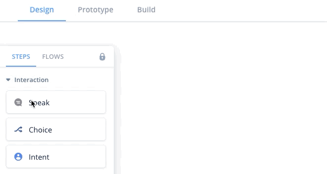

### Speak step features

- Add and layer multiple speech/audio sections
- Have the assistant speak
- Play an audio file
- Stream an audio file
- Supports multiple voices and accents
- Use variables to create a dynamic conversation
- Use SSML to customize the way the assistant speaks
- Preview the way the assistant speaks
- Randomize how the assistant responds

### Add, delete, reorder speak sections for speech and audio

#### Adding sections

Inside the Speak step editor, you can click on either the "System" or "Audio" buttons to add either synthetic text to speech (example, Alexa voice), or you can add an audio section

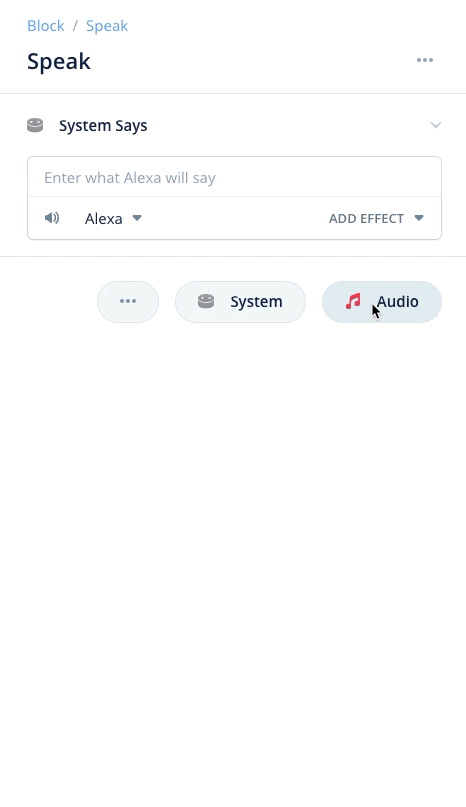

#### Stacking multiple sections

You can add multiple sections within a Speak step, either of System speech or Audio, in any order or length. These sections will playback sequentially from top-to-bottom for the user when the Speak step is activated. To add multiple sections, click on the System or Audio buttons repeatedly.

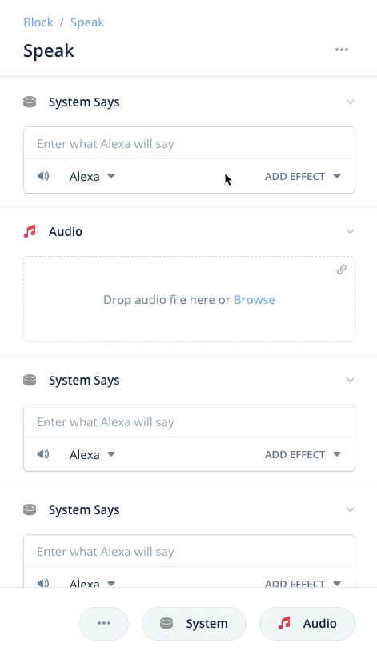

#### Deleting sections

To delete a section within a Speak step, you can either right-click on the step icon, or, you can drag the section below to delete it. 

1. Right click to delete

   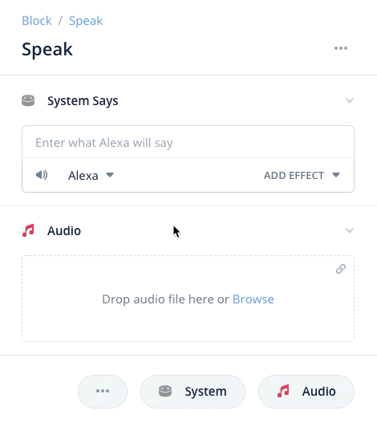

2. Drag down to delete

   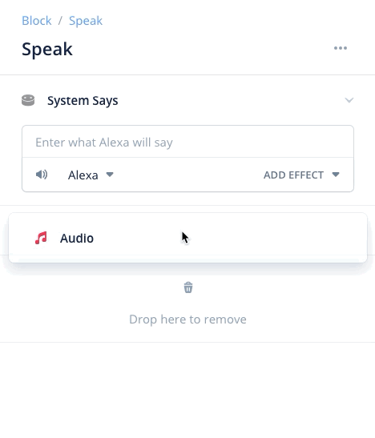

#### Reordering sections

You can re-order the order in which your sections play (remember, they play sequentially down) by clicking and dragging on sections to reorder them.

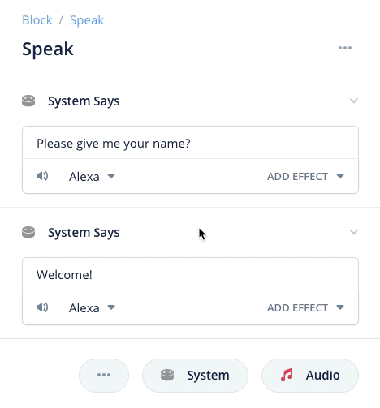

#### Collapsable sections

Sections in every step are collapsable to save space. You can collapse and expand sections by clicking on the arrow on the far right of each section.

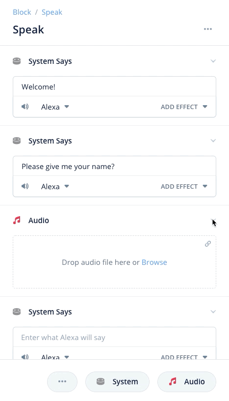

Once collapsed, the section's functionality is not changed and can still be reordered and deleted. To re-expand the section, click on the same arrow used to collapse the section.

#### Play a random section from the Speak step

You can have your assistant play one random section from your Speak step instead of play all of the sections sequentially. To do this, click on the button near the section addition buttons and you'll see the option for randomizing sections. 

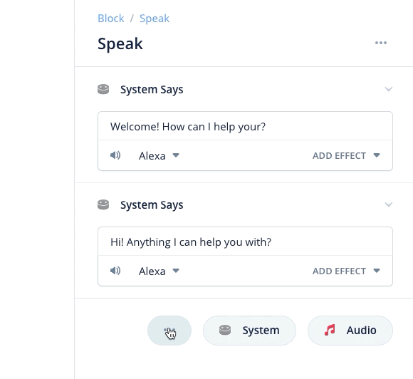

Once turned on, you'll see an icon appear on each section indicating that random section is on. Only one section of all the available sections will randomly play when the step is activated. To turn random section output off, click on the randomize outputs button again and you should see the random output icons disappear from each section.

### Making the assistant speak with system speech

#### Adding system speech

To add a system speech section, click on the icon to add system speech.

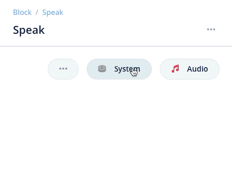

#### Adding system speech

Adding a system speech section within your Speak step allows you to control what the assistant says to the user. You can add text into the speech field, and it will automatically expand as you write more.

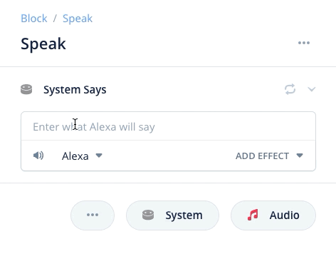

#### Changing the voice of the assistant

You can change the voice of the assistant to one of the default voices provided by Voiceflow for each assistant platform. To change the selected voice for that particular Speak step, click on the voice dropdown and choose the selected voice.

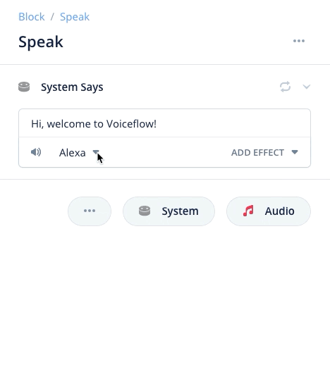

#### Preview assistant responses

You can preview the assistant's response (will play out-loud on your computer) by clicking on the "play" icon in the bottom left of your speech field next to your voice picker.

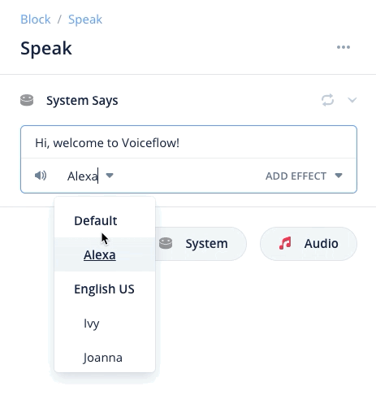

#### Add SSML effects

You can add SSML effects by highlighting a section of text within and then clicking the "add effect" dropdown in the bottom right of the editor. 

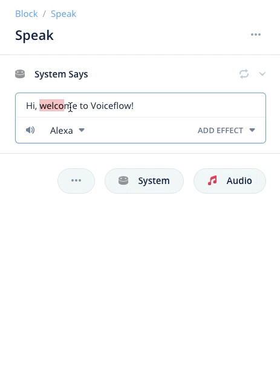

Once effects are added, you can layer multiple effects together to create highly personalized responses.

You can edit implemented SSML effects by clicking on the "descriptor" of the affect which is surrounded by quotations. From here, you can edit the selected effect.

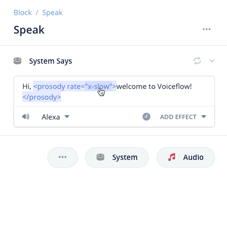

You can re-add recently used effects without having to go through the menu system again by clicking and selecting from the clock icon.

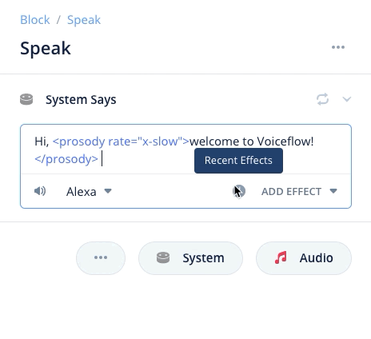

#### Using variables in the Speak step response

You can use variables in your assistants speech response to add dynamic responses that change depending on the situation. As an example, below we have inputted a custom variable called "{name}" which stores the user's first name. This way, we are greeting them by first name to give a more custom response.

To add a variable to a response, start by typing "{" which will open the variable selector menu. From here you can either create a new variable or select an existing variable to insert.

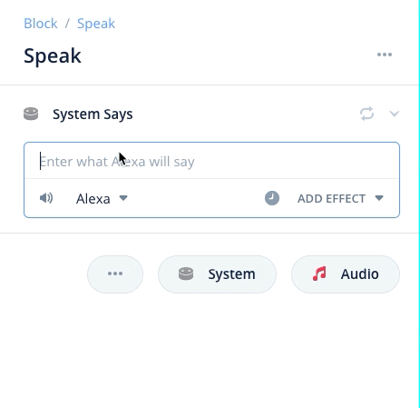

### Play an uploaded audio file

Clicking on the "audio" button in the right hand side of the Speak step editor window will add a new section to the Speak step where an audio file can be uploaded or streamed.

#### Uploading an audio file

From here, you can either browse to upload, or drag-and-drop an audio file into the box. If you are uploading an audio file, it must be a supported length. Voiceflow will automatically convert uploaded audio files to the accepted bitrate of your chosen assistant platform.

1. Click to browse files and upload

   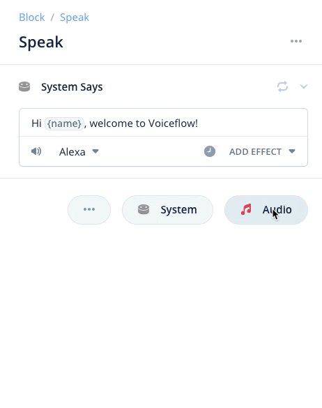

   

2. Drag-and-drop in audio files

   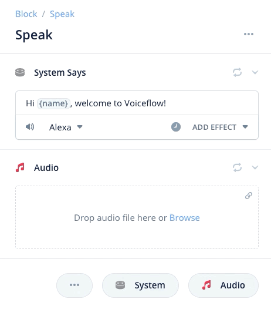

#### Supported audio filetypes

- MP3 - less than 240 seconds (you cannot combine multiple files in a row to get around this). See "Alexa limitations" below.

#### Previewing an audio file

You can preview an audio file in the browser by clicking on the preview button. You can also preview different sections of the audio file by clicking on different parts of the box to scrub the file dynamically.

 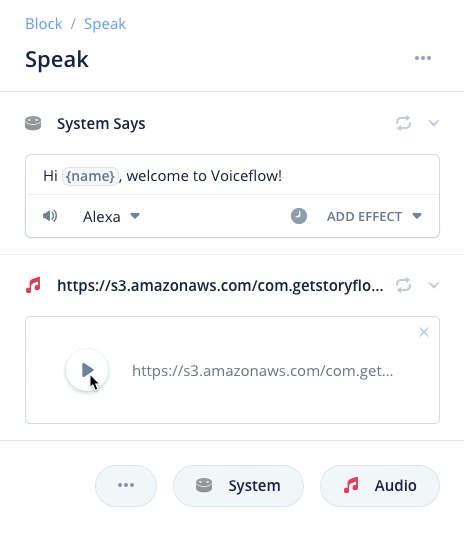

#### Deleting an uploaded audio file

You can delete an uploaded audio file by clicking on the "X" icon in the top right corner of your uploaded file.

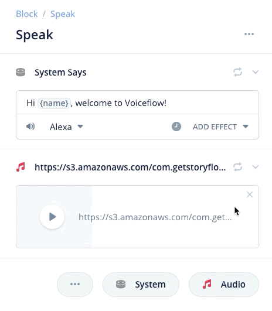

### Stream an audio file

You can stream an audio file by clicking on the link icon in the top right once you have added your audio step. Unlike uploading an audio file, Voiceflow will not host this file so you will have to ensure it follows the proper bitrate of the assistant you are building for. 

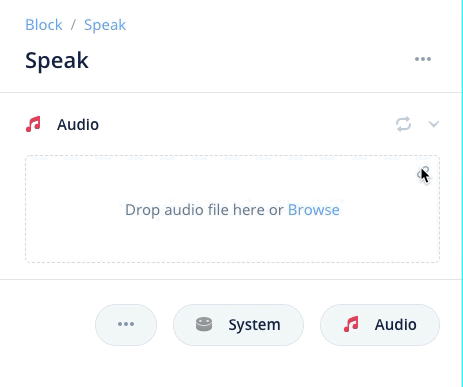

Many popular hosting services can be used such as Dropbox, Airtable or S3. You need to enter the sharable link for the file, not the URL of the file. If the URL is correct, once you hit enter it will turn to a preview section similar to when you upload an audio file on Voiceflow. An example can be found below of a streamed audio file from Dropbox.

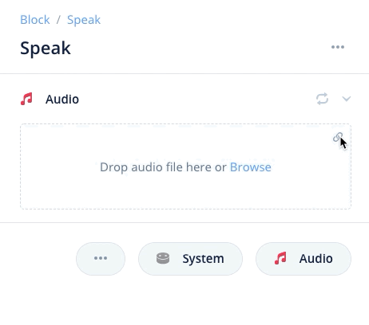

## 

#### Supported audio streaming filetypes

- MP3

#### Dropbox streaming warning

For those using Dropbox, it is very important you change the last digit of the URL from a 0 to a 1 which will enable for sharing permissions. As an example, here is an unaltered Dropbox link: https://www.dropbox.com/s/g5sdb27pri7x2eg/preview.mp3?dl=0

You need to change Dropbox links to https://www.dropbox.com/s/g5sdb27pri7x2eg/preview.mp3?dl=1 where the last digit in the sharable URL is a 1. This will allow for it to work in Voiceflow.

### Alexa specific limitations for Speak step

Files for the Speak step can only be up to 240 seconds if uploading to Alexa, and will be played at a reduced sound quality due to Alexa technical restrictions.

When using the speak step, if you were to use back to back steps with audio uploaded, the audio time within them is added. This is because all steps will process concurrently until the user is faced with user input (i.e. choice step, interaction block, etc.) The limit applies to the total, until there is user input, then this limit resets.
For example: using two back to back speak steps with 2 mins and 3 mins wouldn't work, because that would total five mins. But using speak/choice/speak would, because the time is 'reset' after user input.

## **Choice Block**

### Related articles

- Intents and Slots

### What Are Choice Blocks?

Choice blocks allow you to ask users to make a choice from a pre-defined list of choices. If the user says one of the choices listed in the choice block, it will follow that choice's path. If the user says something that isn't one of the listed choices, the user will follow the ELSE path.

### Adding Choices

To add choices, drag the choice block out from your block menu onto the canvas. You will automatically have a single choice ready. Select an intent from the drop down list to complete your choice block. 

To add more choices to your choice block, hit the "Add Path" button and select and intent. You should see there are now multiple paths on the choice block, one for every path that you have defined.

ELSE Port

If the user responds with something that is NOT one of the listed choice options, then the ELSE block port will be activated. For example, if the user was to say "Zebra" as a response choice block asking the user for a "Yes" or "No" answer, it would trigger the ELSE path. This is because "Zebra" is not close enough to "Yes," "No," or any of their synonyms to trigger either path.

Using ELSE As An Error Handler

You can use the ELSE on a Choice block as an "Error Handler". The Error Handler will repeat the available options back to the user, and ask them to choose again. This allows you to ensure they are always choosing from the available options on the list.

### No Reply Response

If Alexa fails to map whatever the user says to any intent defined in your skill, the No Reply Response occurs. For instance if the user says nothing, gibberish, or *words that aren't part of any intent*, it does not map to an intent. A reprompt needs to be defined with the last outgoing message and the Voiceflow service receives no information when a reprompt happens.

We send out each choice with the default reprompt of the last spoken thing. So if you have a speak block "What color do you like?" followed by a choice block, and Alexa fails to map to an intent, it will simply repeat "What color do you like?"

However, Voiceflow allows you to define custom No Reply Response if you don't want it to repeat the same thing. This can be done on any choice or capture block.

No Reply Response only occur twice and will exit the skill if it still doesn't understand the third time.

## **Intent Block**

### What Are Intent Blocks?

Intent blocks allow you to add shortcuts within your project. With Intent blocks, a user can say an intent at any point within the skill (or outside the skill) and "jump" to that point in the project.

For example, you could add an intent for 'Home' which allows the user to always return to a home menu using the Intent block. Or, you could use a Intent Block to jump to a new place in an interactive story ⏤ the use cases are endless.

### How Intent Blocks Work

Intent blocks only have one outbound port because they do not take an input to be activated. The Intent block is constantly listening for it's keyword or key phrase to activate the block. To setup an Intent block:

### How intent blocks know what to look for

Intent blocks need to be filled with an Intent. Your Intent block will be listening at all times for a users input that matches the intent that is specified.

Intents must be chosen in the drop down menu.

### Jumping around inside a project

Intent blocks allow you jump to specific points inside a project without having to be connected by lines to other blocks. This allows you to jump to an intent block at any point in your project.

Last edited: May 28 2020  
Edited by: braden@voiceflow.com