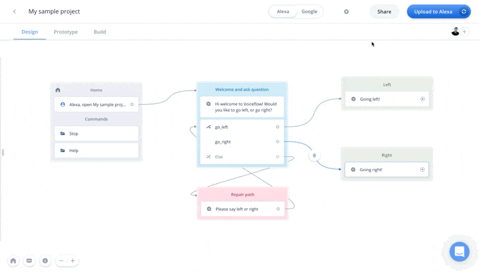

# Sharing features
<b>Voiceflow's sharing features make it easy to share your projects with others.</b>

1. Share a downloadable project link - allow others to download your project via URL link
2. Share prototypes by URL - allow others to test your prototype by sharing a URL link

## Share a downloadable project link
<b>You can share your project to be downloaded and copied by other Voiceflow users using a unique URL. To do this, you can create a downloadable link from within your Voiceflow project.</b>

#### How to create a downloadable link
Project download links can be accessed from the share dropdown within your project.

#### How to download a project
When the sharable link is pasted into the browser, you will see this modal where you can select the workspace you'd like to download the project to:

‌Once a project is downloaded to your workspace you can then access the project from your dashboard. 
This project is now a completely separate version from the original.

## Share prototypes by URL link
<b>Share testable links to allow others to try out your prototype by sharing a URL link.</b>

#### How to generate a sharable prototype link
To generate a sharable prototype link, click on the "Share" button and then hit the "copy" button on "Testable link" to have a testable link for your prototype added to your clipboard. 
You can now go ahead and send your URL to other people for them to try your project in their browser. This will generate a prototype for the current version of the project, and the link will
not update the prototoype as you continue to make changes unless you generate a new sharable link.

#### Sharing a sharable prototype link
Once you have generated and copied a sharable prototype link to your clipboard, you can go to that link in your browser to have a full prototyping experience in the browser.
Users can use both text and voice input to interact with Voiceflow testable link.

===================
 
Last edited: May 28 2020  
Edited by: braden@voiceflow.com  
Docs need an update, or have a question?  Message me!