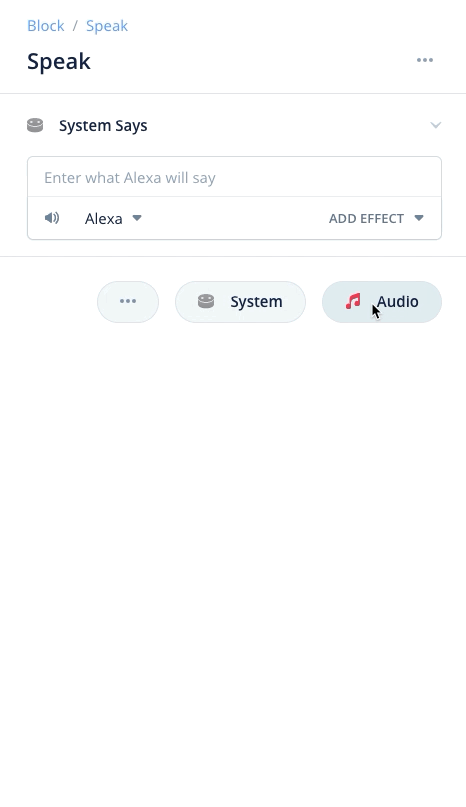
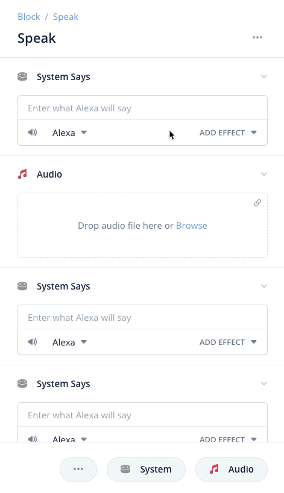
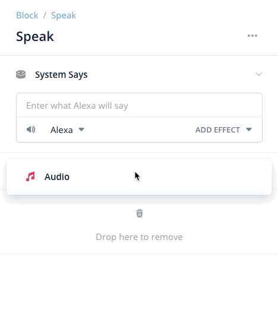
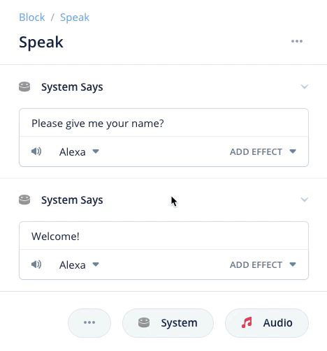
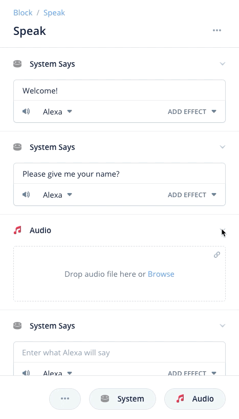
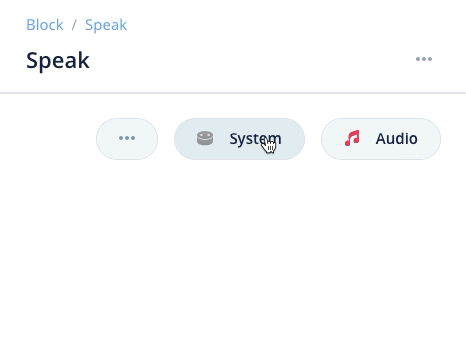
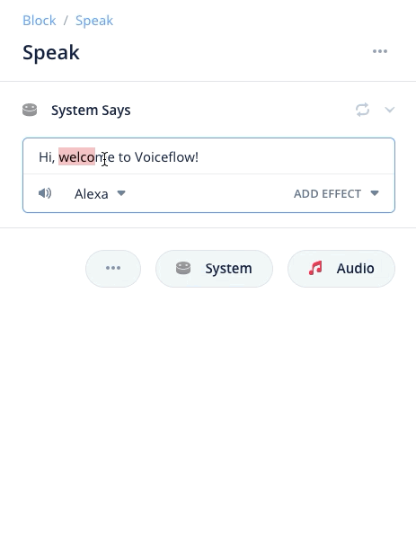
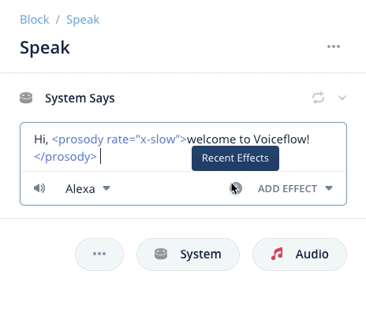
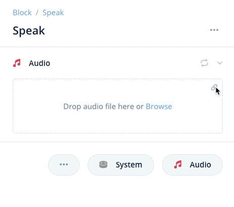

# Interaction steps
<b>Interaction steps are the core Steps that create a conversational interaction between the user and the assistant. 
These are the conversational components that can be used to make the assistant speak, as well as listen and react to the user's intentions in a variety of ways.</b>

These are the interaction steps:
1. Speak step - controls the responses of the assistant
2. Choice step - linear branching choices in a conversation
3. Intent step - jump to a particular part of a conversation

## **Speak step**
<b>The Speak step allows the assistant to respond to the user and "speak" using either a text-to-speech voice or an audio file of a supported format. 
The Speak step can be found in the Interactions section of the Step menu. To add a Speak step to your project, click and drag one onto the canvas. </b>

### Speak step features

- Add and layer multiple speech/audio sections
- Have the assistant speak
- Play an audio file
- Stream an audio file
- Supports multiple voices and accents
- Use variables to create a dynamic conversation
- Use SSML to customize the way the assistant speaks
- Preview the way the assistant speaks
- Randomize how the assistant responds

### Add, delete, reorder speak sections for speech and audio

#### Adding sections

Inside the Speak step editor, you can click on either the "System" or "Audio" buttons to add either synthetic text to speech (example, Alexa voice), or you can add an audio section

#### Stacking multiple sections

You can add multiple sections within a Speak step, either of System speech or Audio, in any order or length. These sections will playback sequentially from top-to-bottom for the user when the Speak step is activated. To add multiple sections, click on the System or Audio buttons repeatedly.

#### Deleting sections

To delete a section within a Speak step, you can either right-click on the step icon, or, you can drag the section below to delete it. 

1. Right click to delete

   

2. Drag down to delete

   

#### Reordering sections

You can re-order the order in which your sections play (remember, they play sequentially down) by clicking and dragging on sections to reorder them.

#### Collapsable sections

Sections in every step are collapsable to save space. You can collapse and expand sections by clicking on the arrow on the far right of each section.

Once collapsed, the section's functionality is not changed and can still be reordered and deleted. To re-expand the section, click on the same arrow used to collapse the section.

#### Play a random section from the Speak step

You can have your assistant play one random section from your Speak step instead of play all of the sections sequentially. To do this, click on the button near the section addition buttons and you'll see the option for randomizing sections. 

Once turned on, you'll see an icon appear on each section indicating that random section is on. Only one section of all the available sections will randomly play when the step is activated. To turn random section output off, click on the randomize outputs button again and you should see the random output icons disappear from each section.

### Making the assistant speak with system speech

#### Adding system speech

To add a system speech section, click on the icon to add system speech.

#### Adding system speech

Adding a system speech section within your Speak step allows you to control what the assistant says to the user. You can add text into the speech field, and it will automatically expand as you write more.

#### Changing the voice of the assistant

You can change the voice of the assistant to one of the default voices provided by Voiceflow for each assistant platform. To change the selected voice for that particular Speak step, click on the voice dropdown and choose the selected voice.

#### Preview assistant responses

You can preview the assistant's response (will play out-loud on your computer) by clicking on the "play" icon in the bottom left of your speech field next to your voice picker.

#### Add SSML effects

You can add SSML effects by highlighting a section of text within and then clicking the "add effect" dropdown in the bottom right of the editor. 

Once effects are added, you can layer multiple effects together to create highly personalized responses.

You can edit implemented SSML effects by clicking on the "descriptor" of the affect which is surrounded by quotations. From here, you can edit the selected effect.

You can re-add recently used effects without having to go through the menu system again by clicking and selecting from the clock icon.

#### Using variables in the Speak step response

You can use variables in your assistants speech response to add dynamic responses that change depending on the situation. As an example, below we have inputted a custom variable called "{name}" which stores the user's first name. This way, we are greeting them by first name to give a more custom response.

To add a variable to a response, start by typing "{" which will open the variable selector menu. From here you can either create a new variable or select an existing variable to insert.

### Play an uploaded audio file

Clicking on the "audio" button in the right hand side of the Speak step editor window will add a new section to the Speak step where an audio file can be uploaded or streamed.

#### Uploading an audio file

From here, you can either browse to upload, or drag-and-drop an audio file into the box. If you are uploading an audio file, it must be a supported length. Voiceflow will automatically convert uploaded audio files to the accepted bitrate of your chosen assistant platform.

1. Click to browse files and upload

   

   

2. Drag-and-drop in audio files

   

#### Supported audio filetypes

- MP3 - less than 240 seconds (you cannot combine multiple files in a row to get around this). See "Alexa limitations" below.

#### Previewing an audio file

You can preview an audio file in the browser by clicking on the preview button. You can also preview different sections of the audio file by clicking on different parts of the box to scrub the file dynamically.

 

#### Deleting an uploaded audio file

You can delete an uploaded audio file by clicking on the "X" icon in the top right corner of your uploaded file.

### Stream an audio file

You can stream an audio file by clicking on the link icon in the top right once you have added your audio step. Unlike uploading an audio file, Voiceflow will not host this file so you will have to ensure it follows the proper bitrate of the assistant you are building for. 

Many popular hosting services can be used such as Dropbox, Airtable or S3. You need to enter the sharable link for the file, not the URL of the file. If the URL is correct, once you hit enter it will turn to a preview section similar to when you upload an audio file on Voiceflow. An example can be found below of a streamed audio file from Dropbox.

#### Supported audio streaming filetypes

- MP3

#### Dropbox streaming warning

For those using Dropbox, it is very important you change the last digit of the URL from a 0 to a 1 which will enable for sharing permissions. As an example, here is an unaltered Dropbox link: https://www.dropbox.com/s/g5sdb27pri7x2eg/preview.mp3?dl=0

You need to change Dropbox links to https://www.dropbox.com/s/g5sdb27pri7x2eg/preview.mp3?dl=1 where the last digit in the sharable URL is a 1. This will allow for it to work in Voiceflow.

### Alexa specific limitations for Speak step

Files for the Speak step can only be up to 240 seconds if uploading to Alexa, and will be played at a reduced sound quality due to Alexa technical restrictions.

When using the speak step, if you were to use back to back steps with audio uploaded, the audio time within them is added. This is because all steps will process concurrently until the user is faced with user input (i.e. choice step, interaction block, etc.) The limit applies to the total, until there is user input, then this limit resets.
For example: using two back to back speak steps with 2 mins and 3 mins wouldn't work, because that would total five mins. But using speak/choice/speak would, because the time is 'reset' after user input.

## **Choice Step**
<b>Choice steps allow you to ask users to make a choice from a pre-defined list of choices. If the user says one of the choices listed in the choice step, it will follow that choice's path. If the user says something that isn't one of the listed choices, the user will follow the ELSE path.
Choice steps are a core component of Voiceflow and can be found in the interaction steps menu.</b>

### Adding Choice paths
Choice steps are made up of intent-based "paths", and the "else" path. When the user reaches a choice step in the conversation, the assistant will begin listening for what the user says.
Depending on what the user says, they will take a different path in the conversation.

### Creating and linking 'intents
Each path represents a different way the conversation could go depending on what the user says. As the Conversation Designer, you choose where the conversation
goes by assigning an intent to each path. An intent is a collection of phrases, also called utterances, that the user might say to signify their intention, or "intent". You
can either select an existing intent, or create a new intent within the choice step. You can also delink intents from each path without deleting the path.

As an example, if we asked a user if they want to go left or right and we want to create a path for the user going right, we would create an intent called "goes_right" and provide some
sample utterances for what the user might say to signify their intention is to go right. Some sample utterances for our "go_right" intent could be:
- "go right"
- "I want to go right"
- "right"
- "please go right"

Now, if the user says any of the sample utterances within the go_right intent, that intent will be triggered and the conversation will follow whatever
path has the go_right intent linked.

### Linking a choice path
When you link a choice path, you are creating the conversation path if the user says the intent of that particular path. For example, if you have an
intent of "order pizza" for path 2 and the user activates the order pizza intent, the user will follow path 2.

To link a choice path, click on the port of your selected path, then click and drag the selected connector to where you want to link.

### The ELSE path (error handling)
If the user responds with something that is NOT one of the listed choice options, then the ELSE block port will be activated. For example, if the user was to say "Zebra" 
as an utterance for a choice step asking the user for a "Yes" or "No" question, it would trigger the ELSE path. This is because "Zebra" is not close enough to "Yes," "No," or any of their synonyms to trigger either path.

If you have the ELSE path unlinked to anything and the user does not trigger any of your intent-linked paths in the choice step, your conversation will stop.
It is suggested that you always link your ELSE path to another step, often to a step which tells the user they said something wrong and should try again.

### No Reply Response

If the assistant does not hear your user's response, or the user's response is gibberish, the No Reply Response occurs. You can define a No Reply Response if this occurs
by clicking on the three-dots button in the choice step and adding a No Reply Response. Many assistants will automatically repeat the previous prompt if a No Response is detected,
however you can customize this response with Voiceflow's No Reply Response field.

No Reply Responses only occur twice and will exit the app if the assistant still doesn't understand after a third time.

## **'Intent Step**
<b>The Intent step, also known as jump steps, allow you to create non-linear conversation paths within your conversation. Unlike the Choice step which requires a direct link
to activate and then branches to multiple paths, the Intent step requires no direct link and can be activated from anywhere within the project by its linked intent. Also unlike
the choice step, the Intent step does not have multiple branching paths and only has one path connector.</b>

### Linking 'intents to an 'intent step
Intent steps having globally available intents that are constantly listening for their linked intent to be invoked by the user. When their
linked intent is invoked, the intent step will activate and its single conversation path will be followed. 

To link an intent to an Intent step, open the Intent step's editor and either select an existing intent to link, or create a new intent.

### Pulling slots from an 'Intent step
Intents linked within an Intent step act like a normal intent and can thus pull slots from the user's utterance if the slots have been
defined. 

### 'Intent step context priority & sub-flows
Intent steps follow Voiceflow's context-model which is a waterfall system where the deepest part of the conversation, either in terms of the
number of completed conversational turns or the level of subflow, determines the priority of the Intent step invoked. The deepest, most contextually
relevant Intent step or Command flow is always chosen. 

As an example, if you have three linked subflows, and an Intent step linked with the "Help" intent on each flow, the Intent step present on the subflow
the user is currently on will be the one that is activated. If you have 3 Intent steps all linked with the "Help" intent on the same flow, the Intent
step that is closest to the user's current conversational turn will be chosen. 

Intent steps are listening globally for their linked intent to be invoked. They are listening according to Voiceflow's waterfall context model. For example, if
the user is on the 3rd subflow and invokes the "help intent", Voiceflow will first search for a matching intent step on their current flow, the 3rd flow. If
Voiceflow does not finding a matching intent, it will jump up to the next layer ("waterfall up") and search for the matching intent there. If it does not find it,
it will again waterfall up and continue this process until Voiceflow either finds the matching intent, or, the user's utterance produces "no match" and no intent
is invoked.

### CanfulfillIntent (Alexa only)
When working on an Alexa platform project, you'll see a toggle within the Intent step which is "CanFullfillIntent". This is a feature
provided by Alexa that allows your live published Alexa Skills to be accessed automatically by Alexa users asking their devices for that particular
intent. You can think of CanFulfillintent as making your website available to search engines - this serves a similar function for Alexa Skills.

===================
 
Last edited: May 28 2020  
Edited by: braden@voiceflow.com  
Docs need an update, or have a question?  Message me!