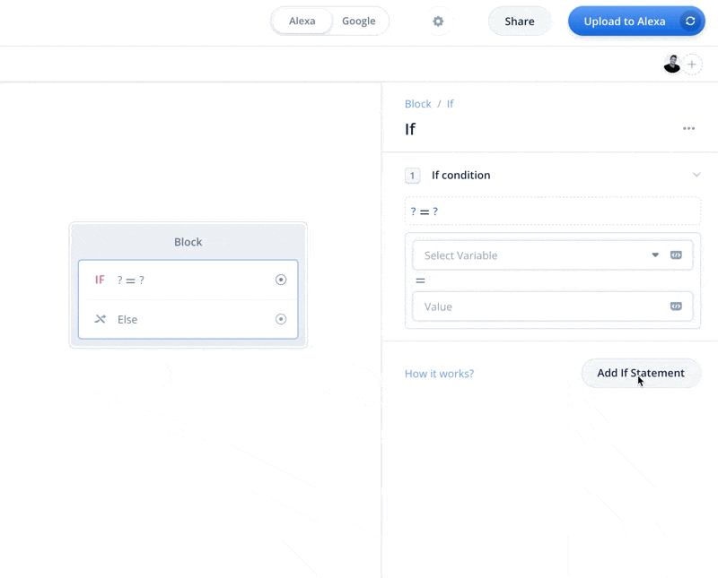
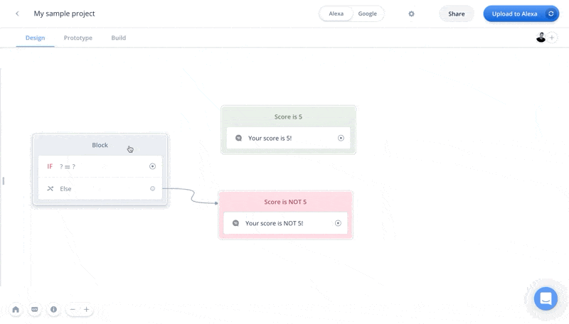
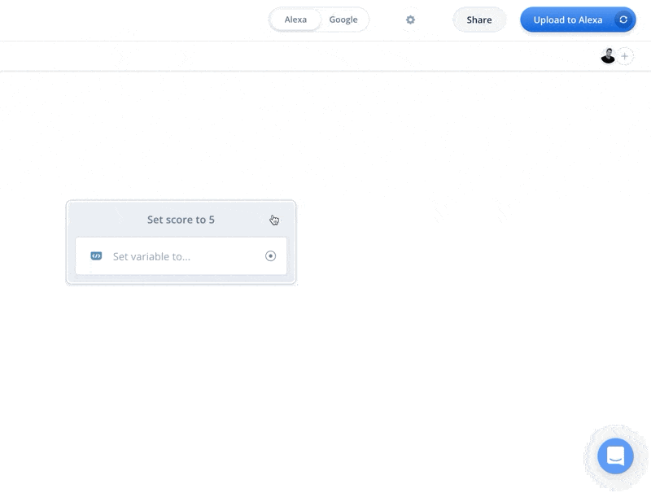
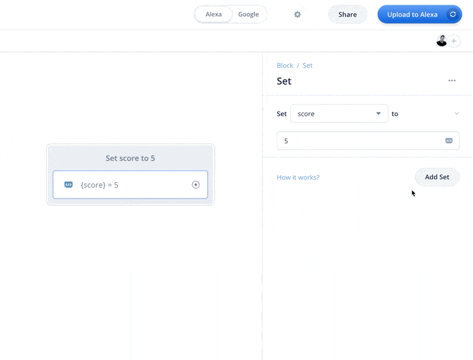
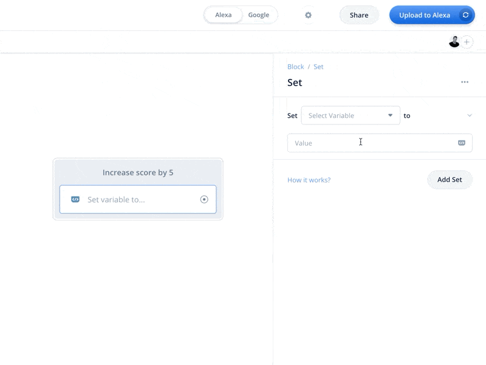
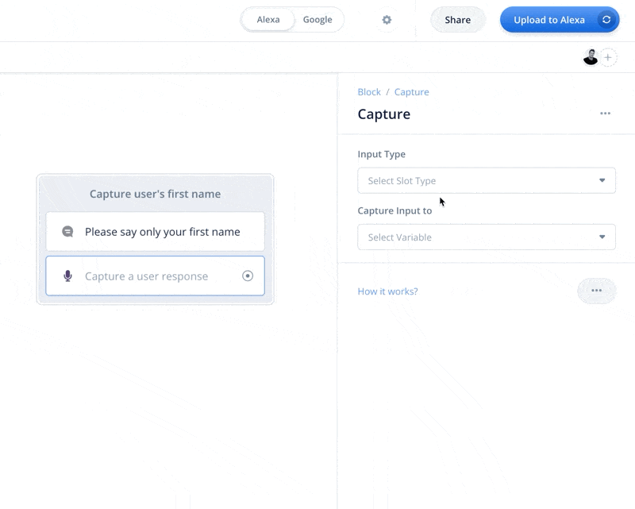
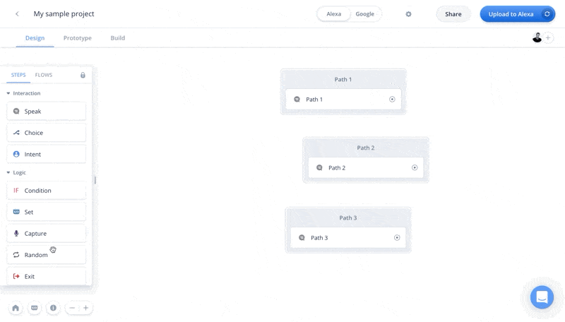
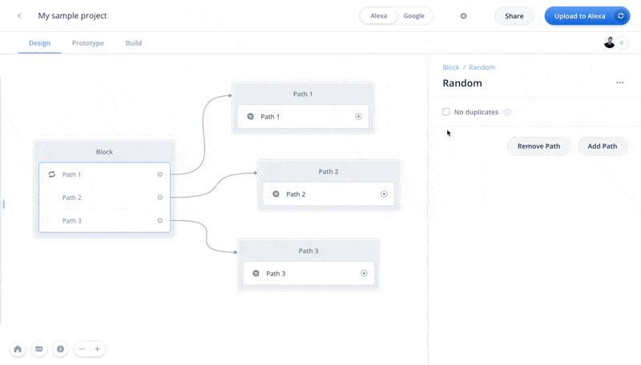

# Logic steps
<b>Logic steps allow you to create more personalized experiences that are shaped by the user's behaviour. You can store the user's name,
change conversation paths depending on the actions of the user, and perform other logical operations.</b>

These are the logic steps:
1. Condition step - branch the conversation based on the value of variables
2. Set step - manually set the value of a variable
3. Capture step - capture and store the user's whole response into a variable
4. Random step - randomly send the user down a different path
5. Exit step - cause the project to end
6. Flow step - create and manage the use of flows 


## **Condition Step**
<b> The condition step, also known as the IF step, allows you to send the user down different conversation paths depending on the value of variable conditions. The Condition Step
can be found in the logic section of the Step menu.</b>

### Adding conditional paths
Similar to the Choice step, the Condition step can have many different diverging paths depending on the actions of the user. To create a path,
click on "Add IF statement". When you add a new IF statement, you'll see the step expand with the new path available.



### Creating conditional (IF) statements
Once you have create the path within your IF step, you can now create the condition that will activate that path. Every condition is about evaluating
if the value of a variable you select against another value you define. If the variable is equal to the value you defined, the path will activate. As an
example, you can select and compare a variable such as "score" to the value of "5", meaning if the set step is activated and the "score" variable is equal to "5",
the conversation will follow that condition (IF) statement's path. Below is an example.



#### Conditions within the Condition step are "checked" sequentially, top to bottom
When the Condition step is activated, conditions (IF) statements within the step will be checked one-by-one, top to bottom. This means if you have
multiple conditions that are all "true" and would activate their path, then the first condition listed that is true will be the one selected.

### The ELSE condition path
The ELSE condition path within the IF step is similar to that of the Choice step because it is activated when none of the other paths can be activated. For example,
if we have one condition checking if the score variable is equal to 5, and when the condition step is activated the score variable's value is
6, then the ELSE condition path will activate and be followed in the conversation.


### Conditions require exact matches
Condition statements require exact matches when comparing the selected variable and value. This means if you are comparing an "animal" 
variable and value of "dog", and the user says "Dog" with a capital D, then the condition will not be met as it is not an exact match.
It is very important that you set up your conditions so that they will only evaluate for exact matches. If you are comparing what a user said
to branch the conversation, it is better you use a Choice step.

#### Maximum number of paths

Within the IF block you can create conditions. These conditions are numbered and will be evaluated in numerical order. 
You can create up to 20 different conditions within a single IF block.

## **Set step**
<b>The Set step allows you to set and change the value of variables. The Set step can be found in the logic section of the Steps menu.</b>

### Setting and changing variable values
The Set step allows you to change the value of a variable when the Set step is activated. To do this, you select the variable whose value you
would like to set, then you enter the value you would like the variable to adopt.



### Changing multiple variable values at once
You can change the value of multiple variable values at once by adding additional "Sets" within the Set step. To do this, click on "Add step" within
the Set step editor. When you have multiple variable sets in a row, they will run sequentially and change the variable values from top-to-bottom. 



### Performing equations
You can perform equations within the Set step so that your apps are more dynamic. As an example, you can increment variables
 using the Set step so that every time an action is taken, such as the user answering a question correctly, the score
variable is increased.

To do this, and other equations, first select the variable whose value you would like to change. Then, when deciding the value to set the variable to,
click on the "add expression icon" within the value field, and then choose the operation you would like to perform. In our score example, we want to
set the value of "score" equal to "score + 5" which would be our equation. 



### Dynamic equations
When performing equations that are meant to be done multiple times in a row, such as incrementing a score variable, it is important that the equation is setup
so that you are setting the original variable equal to itself, plus the new value - for example - "score" = "score + 10". The reason for this is otherwise if you set
"score" = "5 + 5", you will get the right answer the first time, but the value for "score" will always be "10" and will not dynamically change every time the
 user activates the Set step.

## **Capture Step**
<b>The Capture step allows you to capture the whole response from the user and store it within a variable. Note that the Capture step captures
the entire response, meaning every word the user says when this step is activated (the user will know). If you want to capture only certain elements of 
what the user says, use the Choice step. The Capture step can be found within the logic section of the Steps menu.</b>

### Setting up a Capture step
When setting up a Capture step, you are required to enter two different fields: 1) slot type, and 2) selected variable. 

The Slot type is the type of value that your assistant is going to look for. You can use either a custom-slot type, or a provided slot type made available by the assistant platform
you are building for. In the example below, we use Alexa's built-in US-FIRST-NAME slot type as we are capturing a first-name. 

The second field is the selected variable you are looking to store the captured value. In our below example, once we have captured the US-FIRST-NAME slot,
we are going to store that value in the "name" variable we have created.



#### Do not use the Capture step for choices
It's a common mistake to use the Capture step paired with an Condition (IF) step to have the user make choices. While this works in theory, it
most often breaks projects because the Capture step captures everything a user says. Because Condition statements have to be exact, if the user adds one "um",
to their utterance, the whole Capture/IF condition choice is broken and will not work. When having users make choices, it is better to use a Choice step or Intent step.

### No Response
If the user does not respond to your Capture step, you can have the assistant reprompt the user to be asked again. To do this, click the three dot menu and select "No Reply Response" to
add an optional "No reply response".


## **Random step**
<b>With the Random step, you can create multiple different conversation paths, and when the user reaches the random step, they will randomly be sent down one 
   of the available conversation paths. The user will not be prompted, and they will not know that they were sent down a random path (unless you tell them of course). The Random step can be found in the logic section of the Steps menu.</b>

### Creating random paths
To create random paths that will be available when the step is activated, click "Add path". When you add paths, you will see the step expand in the number
of available paths. You can also remove paths by clicking "Remove path". From here, link the paths as you would a normal step in Voiceflow. If a path is unlinked and
chosen randomly, the app will end so be sure to have every path linked.

Below, the user would be sent down one of the three random paths when activated.



### No duplicates - don't go down the same path twice

The no duplicates option makes the user not go down the same path twice if the same Random step is activated multiple times. 
For example, if there are 3 random options, the no duplicates option will not activate the same path twice in a row until all of the options have been taken. Once all the options have been hit, the Random step will reset.



## **Exit Step**
<b>The exit step will automatically end the conversation and app, without any further messages to the user. It can be thought of as a way to "force-quit" the app
if needed. The Exit step can be found in the logic section.</b>

### Closing the app in a subflow
The Exit step is uniquely used to force your app to close when inside of a subflow, or a command flow. Whilst on the HOME flow, the Exit step is not required to exit your project - if your conversation ends without a prompt or without a path connecting the conversation to the next step - 
the conversation will end on its own. However, when the user is within a subflow - the conversation will not end and instead will "waterfall" up to the next layer of subflows, or to the home flow. 
This is the unique situation where Exit steps are essential - when you need to force the stopping of the conversation from within a subflow, or from

### Using the Exit step
Using the Exit step is easy as it only needs placement. Once in place, if the Exit step is activated it will automatically end the conversation.

## **Flow Block**

### What are flows?


A flow is a set of blocks in Voiceflow organized within a single canvas. When you are working on Voiceflow, everything you can see on the canvas is all stored within a single flow. 


Flows can contain other flows, allowing you to stack them and organize thousands of Voiceflow blocks into easy, manageable sections that you can duplicate and reuse.

Flow blocks work like a file system for your projects - you can see this on the left by clicking the flows tab or hitting the Flows hotkey (CMD + > on Mac and Ctrl + > on Windows)


### Flow diagram

Once a flow has been entered, you are shown a version of the start block that carries on from where the flow block beggins. This block acts similary to the standard start block in the ROOT flow but will not be the starting point of the project, only for the specific flow that it is in.


### The ROOT flow


The ROOT flow is the main flow for your project. When you start a new project, you will see the ROOT flow as the only flow. You cannot change the name of the flow, or delete this flow. Every flow used will be a sub-flow of the ROOT flow.


There are three settings for each flow block:


- **Rename:** change the name of your flow

- **Duplicate:** duplicate the flow

- **Delete:** delete the flow


1. **Editing flow names** You can edit every flow name except for the ROOT. When you do this, you cannot rename a flow to a name that is already taken. 

2. **Copying flows** When copying flows you will copy just the single flow. For example, if you are copying a flow that has a flow within it, you will only be able to copy one layer at a time. Doing so will produce an exact duplicate of the flow you had copied.

3. **Deleting a flow** When you delete a flow you are deleting it permanently. It is highly recommended you do not delete flows unless you 100% are sure of doing so.


### Flows Menu


The Flows menu has a list of flows as well as a search bar at the bottom that allows you to search through your flows.

**Reusing flows**


You can reuse flows by dragging a new flow block onto the canvas and rather than hitting the 'create new flow' button, you can select from the list of existing flows. You can do this by clicking on your newly placed flow block, and on the right menu you'll see the bar to 'select existing flow'.


By doing this you'll be able to reuse the flow. If the other flow was in the 'other flows' menu, you will see this flow be taken out of that menu, and placed back into the flow tree according to where you placed your flow block.


### Creating flows


Within the flow block, you can hit the button create flow to create a new flow within your flow tree. If you do not create the flow within the flow block, the flow will not exist in your flow tree and will lead to a dead-end block for the user.


Once you hit 'Create New Flow', you will be brought into a new canvas where you'll only have a start block. From here you can build your new flow.


Once you create the flow, you will see your new flow active on the left flow bar showing your flow diagram. The active flow you are on is always highlighted in blue.


### Local variables in flows


Flows have their own variables called local variables. For example, if you were to have two different flows called 'A' and 'B', each flow would have its own unique set of local variables. This means that you can have variables with the same name, such as {score} in two different flows without them colliding.


Local variables are different than global variables which are accessible throughout your project and will collide between flows


### Sharing local variables between flows


If you want to have local variables shared across flows, you can do so by using the variable mapping feature on the settings bar (right bar when you click on a block) of each block.


Each flow block, except the ROOT flow, can have input, and output variables. Flow blocks can have both, either, or no variable inputs and outputs.


- **Input variables:** local variables being passed into that flow from the flow above it in the flow tree diagram

- **Output variables:** local variables that are passed out of the flow diagram, back into the flow above it in the tree diagram. 

## **Code Block**

### Code Block Overview

The code block accepts a popular programming language known as **JavaScript**. If you don't know how to code, that's alright! Thankfully, there's lots of resources we can use to integrate this block into our skill's logic. 


### JavaScript Resources

- [W3Schools](https://www.w3schools.com/js/) - good for learning JS syntax and supported functions
- [Stack Overflow](https://stackoverflow.com/) - good for finding answers to specific questions (must specify that you're using JS in your search).

### Beginner's Example

To store a random number from 0 - 100 in the {random_num} variable put this in your Code block:


```
random_num = Math.floor(Math.random() * 101); 
```

Declare 'random_num' as a variable on Voiceflow. Connect the Code block to a Speak block that states "The random number is {random_num}" and run your project on the Voiceflow test tool. 


I copied this code from [here](https://www.w3schools.com/js/js_random.asp). Easy stuff, right? 

### Advanced Example

To get the current date in (yyyy/mm/dd) format put this in your code block:


```
var today = new Date();
var dd = today.getDate();
var mm = today.getMonth()+1; //January is 0!
var yyyy = today.getFullYear();

if(dd<10) {
    dd = '0'+ dd
} 

if(mm < 10) {
    mm = '0'+ mm
} 

var todaysDate = yyyy + '-' + mm + '-' + dd;
```

Declare 'todaysDate' as a variable on Voiceflow. Connect the Code block to a Speak block that states "The current date is {todaysDate}" and run your project on the Voiceflow test tool. 


