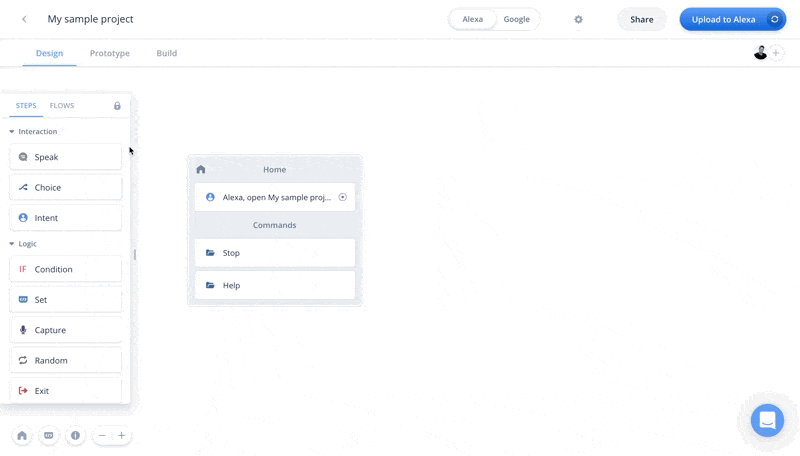
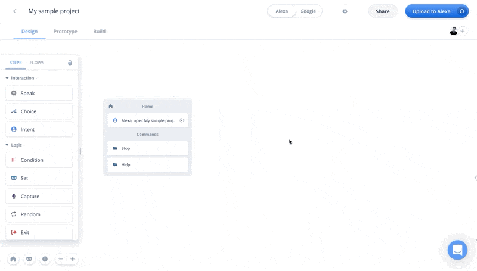
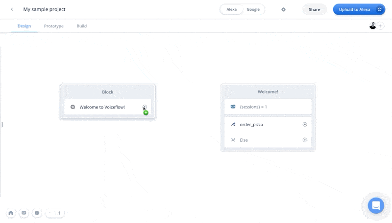
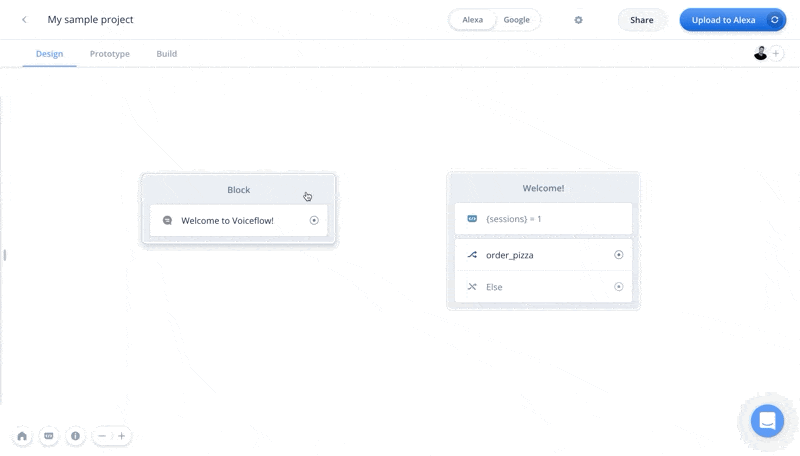
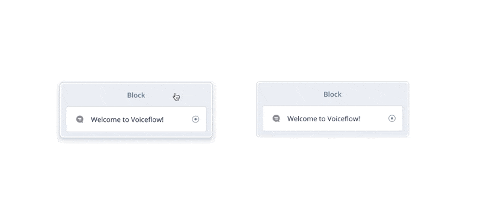
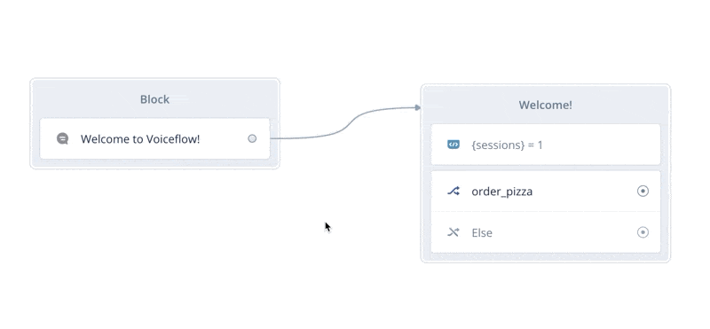
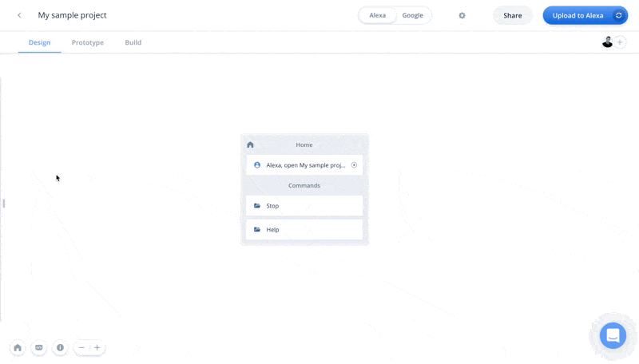
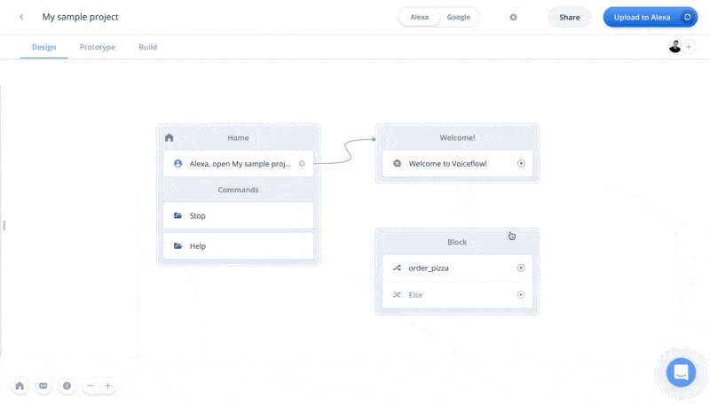
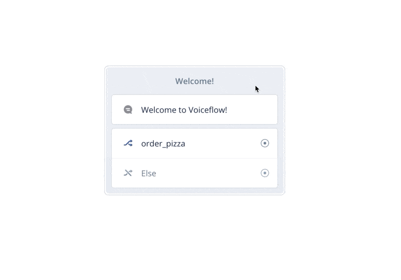

# Steps overview
<b>Steps are the foundational components used to design and build your conversation. Steps in Voiceflow represent packaged functionality
that can be dragged-&-dropped onto the canvas to create functionality. From there, steps can be link, and combined into blocks.</b>

#### Adding Steps
There are two main ways to add steps to the Canvas: dragging-and-dropping from the Step Menu, and using Hotkeys.

<b>1. Dragging-and-dropping</b>
To drag-and-drop a Step onto the Canvas, click on the step and drag it onto the Canvas by holding your click until the Step is on the canvas.
You can only drag-and-drop Steps onto the Canvas when

<b>2. Using hotkeys</b>
You can add Steps to the Canvas by using the add-step Hotkey. To do this, hit the space-bar and then either select the step you'd like, or
type the name of the Step you'd like. Then, hit enter.

#### Connecting steps
To connect two steps, you can either link them together by either:

<b>1. Connect steps with a line</b>
To connect two steps with a line connector, click and drag a line from the port on the first step to the step you want to connect it to.

<b>2. Combine the steps with a turn-block </b>

#### Deleting steps
To delete a step, you can:

<b>1. Select the step and hit the delete key</b> 
<b>2. Right-click on the step and select "delete"</b>

#### Deleting line connectors
To delete a line connecting two steps, hover over the line and click the trashcan icon in the middle of the line.

#### The Steps Menu
The Step Menu is where you'll find all of your available Steps, and your Flows. To access the Steps Menu, move your cursor to the far left
side of the Canvas whilst on the "Design" tab in Voiceflow. The Steps Menu will slide out, and from here you can access steps.

You can lock the Step menu in-place by hitting "lock" icon in the top right of the Steps menu. This will lock the Steps menu in place on the canvas whilst
having the menu unlocked will collapse the menu when you are not using it.

#### Combining Steps into turn-blocks ("blocks")
Conversations are a series of "turns" between the user and the assistant. Each "turn" is comprised of a series of Steps. You can combine Steps
together in Voiceflow to create "blocks" which act as one turn between either the user or the assistant. When two steps are combined, they are
connected together and will play in order sequentially from top to bottom.

To combine Steps, drag two eligible steps on-top of each other and if they are able to combine into a block, they will show the option. You
can either combine two existing steps on the canvas together, or you can drag-and-drop a new step onto an existing step.

##### Certain Steps cannot combine, and must be the first, or last step in a turn-block
Voiceflow's combined "turn-blocks" mimic natural conversation flow where two users take their "turn" in a conversation, and these turns are represented by combined blocks of steps, or "turn-blocks".
Some steps must be the first, or last, in a conversational turn. These steps cannot be combined with each other because there can only be one first, or last step within
a combined turn-block.

<b>1. Steps that must be first in a turn-block</b>
Some steps must always be the first Step in a turn block because in a conversation they always begin a turn. Steps that must be first when combined:
- Intent step

<b>2. Steps that must be last in a turn-block</b>
Some steps must always be the last Step in a turn block because in a conversation they always end a turn. Steps that must be last when combined:
- Choice step
- IF step
- Random step
- Exit step

#### Coloring turn-blocks
You can change the color of a block by right-clicking on the block, selecting "block color" and choosing a color.

